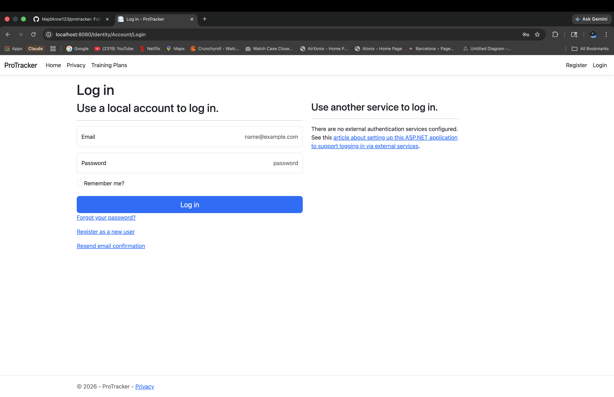
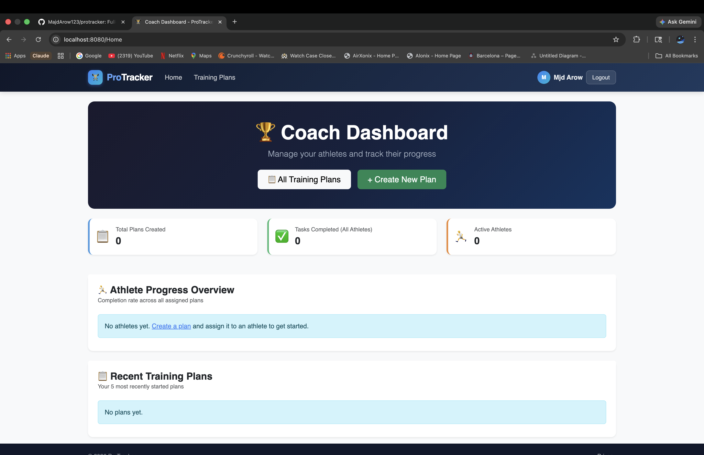
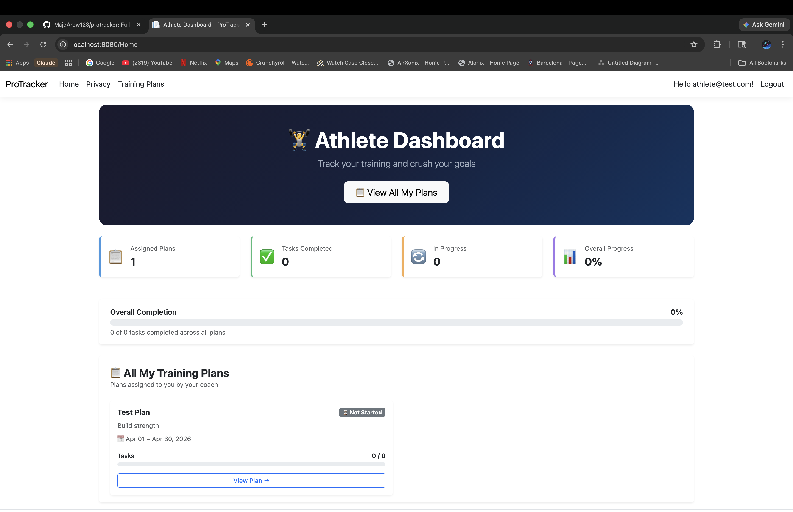
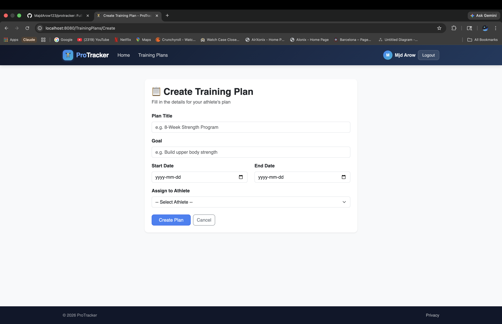
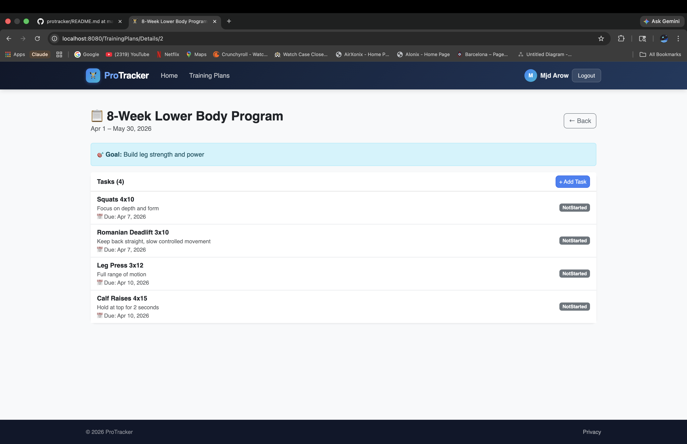

# 🏋️‍♂️ ProTracker
A full-stack athlete and training management system built with ASP.NET Core MVC.  
Coaches can create and assign training plans with tasks, while athletes can track their progress in real time.

🌐 **Live Demo:** [protracker-production.up.railway.app](https://protracker-production.up.railway.app)


---

## 🚀 Features
- 👤 User authentication with custom display names & role-based access (Coach / Athlete)
- 🏆 Separate Coach and Athlete dashboards based on role
- 📋 Coaches can create, edit, and delete training plans
- 📌 Coaches can assign training plans to specific athletes
- ✅ Coaches can add tasks to training plans with due dates
- 🏃 Athletes can view assigned plans and track task progress
- 📊 Real-time progress bars showing task completion
- 🔒 Role-based authorization throughout the app
- 🗂 Clean MVC architecture

---

## 🛠 Tech Stack
| Layer | Technology |
|---|---|
| Backend | ASP.NET Core MVC, C# |
| Database | SQLite (Code-First with EF Core) |
| Auth | ASP.NET Core Identity + Roles |
| Frontend | Razor Views, Bootstrap, HTML/CSS |
| ORM | Entity Framework Core |
| Deployment | Railway |

---

## 📁 Project Structure
```
ProTracker/
├── Controllers/        → Handles HTTP requests & business logic
├── Models/             → Data models (TrainingPlan, TaskItem, ApplicationUser)
├── Views/              → Razor UI pages
├── Data/               → EF Core DbContext & migrations
├── Areas/Identity/     → Authentication & registration pages
└── wwwroot/            → Static files (CSS, JS)
```

---

## 🧪 Test Accounts
You can try the live demo using these credentials:

| Role | Email | Password |
|---|---|---|
| Coach | coach@test.com | Coach123! |
| Athlete | athlete@test.com | Athlete123! |

---

## ⚙️ Setup Instructions

1. **Clone the repo**
```bash
git clone https://github.com/MajdArow123/protracker.git
cd protracker
```

2. **Install dependencies**
```bash
dotnet restore
```

3. **Apply database migrations**
```bash
dotnet ef database update
```

4. **Run the app**
```bash
dotnet run
```

5. Open your browser at `http://localhost:8080`

---

## 📸 Screenshots

### 🏠 Home Page


### 📝 Register


### 🔐 Login


### 🏆 Coach Dashboard


### 🏃 Athlete Dashboard


### ➕ Create Training Plan


### 📄 Plan Details


---

## 👨‍💻 Authors
- [@MajdArow123](https://github.com/MajdArow123)
- [@Majd205](https://github.com/Majd205)
