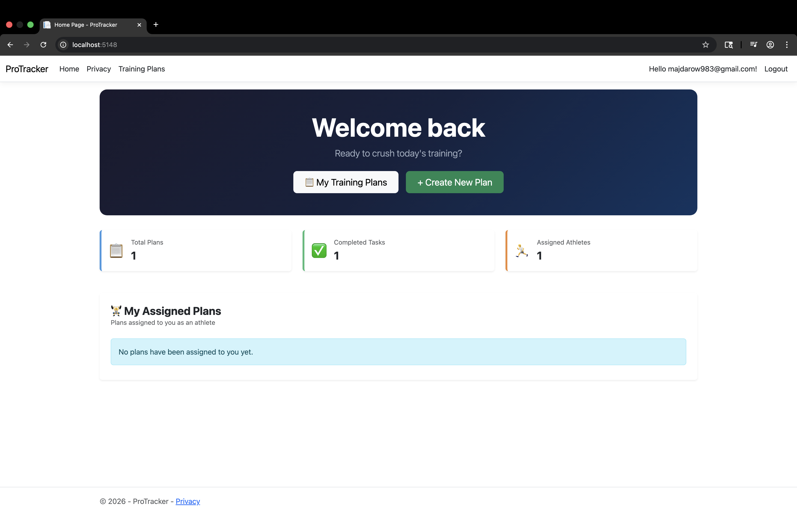
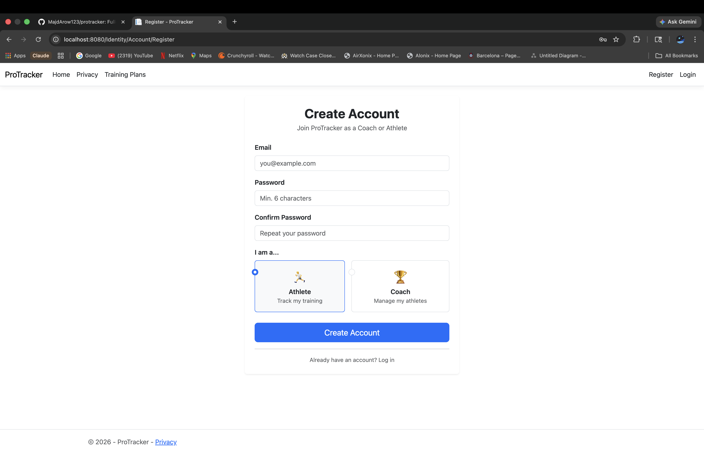
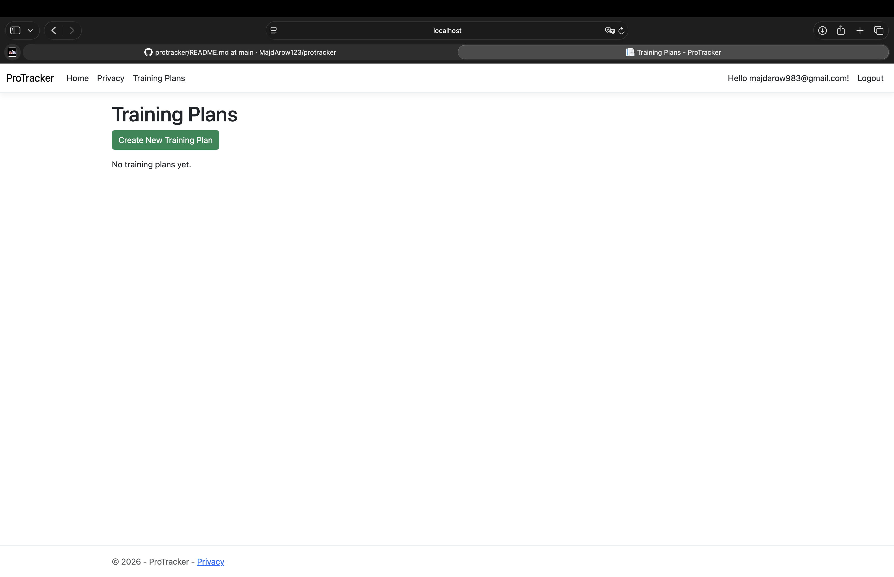

# 🏋️‍♂️ ProTracker

A full-stack athlete and training management system built with ASP.NET Core MVC.  
Coaches can create and assign training plans, while athletes can track their tasks and progress.


---

## 🚀 Features

- 👤 User authentication & role-based access (Coach / Athlete)
- 📋 Coaches can create and manage training plans
- 📌 Assign training plans to specific athletes
- 🏃 Athletes can view their assigned plans and tasks
- ✅ Task tracking with status updates
- 🗂 Clean MVC architecture

---

## 🛠 Tech Stack

| Layer | Technology |
|---|---|
| Backend | ASP.NET Core MVC, C# |
| Database | SQLite (Code-First with EF Core) |
| Auth | ASP.NET Core Identity |
| Frontend | Razor Views, Bootstrap, HTML/CSS |
| ORM | Entity Framework Core |

---

## 📁 Project Structure
```
ProTracker/
├── Controllers/        → Handles HTTP requests & business logic
├── Models/             → Data models (TrainingPlan, TaskItem, etc.)
├── Views/              → Razor UI pages
├── Data/               → EF Core DbContext & migrations
├── Areas/Identity/     → Authentication pages
└── wwwroot/            → Static files (CSS, JS)
```

---

## ⚙️ Setup Instructions

1. **Clone the repo**
```bash
git clone https://github.com/MajdArow123/protracker.git
cd protracker
```

2. **Install dependencies**
```bash
dotnet restore
```

3. **Apply database migrations**
```bash
dotnet ef database update
```

4. **Run the app**
```bash
dotnet run
```

5. Open your browser at `https://localhost:5001`

---

## 📸 Screenshots

### 🏠 Home Page


### 🔐 Register Page


### 📋 Training Plans

---

## 🔮 Planned Features

- [ ] Coach dashboard with athlete progress overview
- [ ] Task due date reminders
- [ ] Athlete performance history
- [ ] Mobile-responsive UI improvements

---

## 👨‍💻 Authors

- [@MajdArow123](https://github.com/MajdArow123)
- [@Majd205](https://github.com/Majd205)
