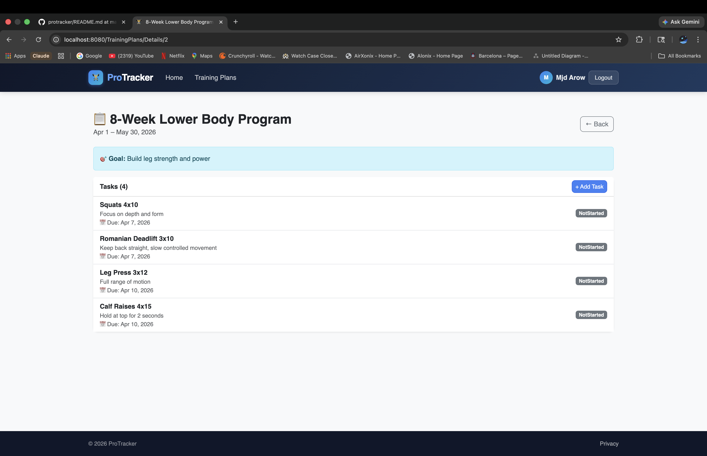

<div align="center">

# 🏆 ProTracker

### AI-powered multi-sport athlete & team performance tracking platform for coaches and athletes

[](https://protracker-iota.vercel.app)

[](https://react.dev/)
[](https://www.typescriptlang.org/)
[](https://dotnet.microsoft.com/)
[](https://railway.app/)
[](https://www.anthropic.com/)
[](https://protracker-iota.vercel.app)
[](LICENSE)

</div>

---

ProTracker is a full-stack platform where coaches manage multi-sport teams and athletes own their development. Coaches record sport-specific assessments, generate **AI improvement plans, nutrition meal plans, and task suggestions**, run injury-recovery programs, and read completion analytics. Athletes get a personal dashboard with radar charts, daily wellbeing check-ins, recovery tracking, tasks, and direct messaging — all behind a JWT-secured REST API.

## 🚀 Try the Live Demo

> ### **▶ [protracker-iota.vercel.app](https://protracker-iota.vercel.app)**
> No signup required — log in with a seed account below and explore **both roles** instantly.

| Role | Email | Password |
|------|-------|----------|
| ⚽ Soccer Coach | `coach.soccer@protracker.seed` | `SeedCoach123!` |
| 🏀 Basketball Coach | `coach.basketball@protracker.seed` | `SeedCoach123!` |
| 🏐 Volleyball Coach | `coach.volleyball@protracker.seed` | `SeedCoach123!` |
| 🎾 Tennis Coach | `coach.tennis@protracker.seed` | `SeedCoach123!` |
| 🏖️ Beach Volleyball Coach | `coach.beachvolley@protracker.seed` | `SeedCoach123!` |
| 🏃 Athlete (Soccer) | `lucas.ward@protracker.seed` | `SeedCoach123!` |
| 🏃 Athlete (Basketball) | `marcus.bell@protracker.seed` | `SeedCoach123!` |

> 💡 **Tip:** Sign in as a **coach** for team management, AI tools, and analytics; sign in as an **athlete** for the personal dashboard, wellbeing check-in, tasks, and recovery program.

## ✨ Key Features

<table>
<tr>
<td width="50%" valign="top">

#### 🤖 AI-Powered
- **Weekly nutrition plans** — 7-day, sport-specific, macro-balanced
- **Improvement plans & performance insights**
- **Smart task suggestions** from weak assessment areas
- **Injury recovery program generation**
- **Nutrition guidance** + food-swap recommendations

#### 📊 Performance Analytics
- Multi-period assessments with trend analysis
- Per-player **skill radar charts**
- Team comparisons & reports
- **Match results** with sport-aware scoring
- **Task completion analytics** (rates, trends, callouts)

#### 🏋️ Training & Recovery
- Injury tracking with recovery status
- **10 built-in recovery-plan templates** + AI generation
- Training-session scheduling (weekly calendar)
- Exercise completion with difficulty ratings

</td>
<td width="50%" valign="top">

#### 💬 Communication & Tasks
- Direct **coach ↔ athlete messaging**
- Task assignment with AI suggestions
- Team announcements with priority levels
- Shared coach notes (private or shared)

#### ❤️ Athlete Wellbeing
- Daily **check-in** (feeling / energy / sleep + pain)
- 30-day trend charts per athlete
- Team wellbeing dashboard card
- Pain-during-recovery alerts to the coach

#### 🏆 Multi-Sport Support
- Soccer, Basketball, Volleyball, Beach Volleyball, Tennis
- Sport-specific positions, stats & score formats
- Color-coded sport identity throughout

#### 📱 Role-Based Experience
- **Coaches** — full management & analytics
- **Athletes** — dashboard, check-ins, recovery, tasks
- JWT auth · dark / light mode · unit toggles

</td>
</tr>
</table>

## 🛠️ Tech Stack

<table>
<tr><th>Backend</th><th>Frontend</th></tr>
<tr valign="top"><td>

- **ASP.NET Core 9** Web API (C#)
- **Entity Framework Core 9** + Npgsql
- **PostgreSQL** (Railway)
- **JWT Bearer** auth + refresh tokens
- **Anthropic Claude API** (Haiku + Sonnet)
- FluentValidation
- xUnit integration tests
- Docker · Railway (auto-deploy)

</td><td>

- **React 19** + **Vite** + **TypeScript**
- **Tailwind CSS v4**
- **TanStack Query v5** (server state)
- **Recharts** (radar / line / bar)
- **Framer Motion** (animations)
- **React Router v6**
- Lucide React · clsx · Axios
- Vercel (auto-deploy)

</td></tr>
</table>

## 📸 Screenshots

| Sign In — "Stadium Lights" | Coach Dashboard |
|---|---|
|  |  |
| _Split-screen auth with animated backdrop_ | _Teams, overdue tasks, injuries & team wellbeing_ |

| Players List | Player Profile |
|---|---|
|  |  |
| _Roster with injury indicators & unit toggles_ | _Assessments + tabs: injuries, matches, tasks, wellbeing_ |

| Athlete Dashboard | AI Nutrition Plan |
|---|---|
|  |  |
| _Radar chart, wellbeing check-in, tasks & recovery_ | _7-day AI meal plan with per-meal macros_ |

> 🔎 Recovery programs, coach ↔ athlete messaging, and task analytics are best explored in the **[live demo](https://protracker-iota.vercel.app)**.

## 💻 Getting Started

**Prerequisites:** [.NET 9 SDK](https://dotnet.microsoft.com/download), [Node.js 20+](https://nodejs.org/), [PostgreSQL](https://www.postgresql.org/), and an [Anthropic API key](https://console.anthropic.com/).

```bash
git clone https://github.com/MajdArow123/protracker.git
cd protracker
```

**1. Configure the backend** — create `appsettings.Development.json` (gitignored):

```json
{
  "ConnectionStrings": {
    "DefaultConnection": "Host=localhost;Port=5432;Database=protracker_dev;Username=youruser"
  },
  "Anthropic": {
    "ApiKey": "sk-ant-..."
  }
}
```

**2. Run the backend** (applies migrations + seeds demo data on first run):

```bash
dotnet ef database update
dotnet run --urls http://localhost:8080
```

**3. Run the frontend** in a second terminal:

```bash
cd protracker-client
npm install
npm run dev
```

Open **http://localhost:5173** and sign in with any [seed account](#-try-the-live-demo).

```bash
# Run the backend test suite
dotnet test
```

> AI features require Anthropic billing credits. Weekly plans use Claude **Haiku** (~fractions of a cent per generation); insights use **Sonnet**.

## ☁️ Deployment

| Component | Host | Notes |
|---|---|---|
| **Backend** | Railway (Docker) | Auto-deploys from `main`; migrations apply on startup |
| **Database** | Railway PostgreSQL | `DATABASE_URL` injected & parsed automatically |
| **Frontend** | Vercel | Auto-deploys from `main`; `VITE_API_URL` → Railway backend |

Health check at `/api/health`. On startup the app migrates the database and runs an **idempotent seeder** (coaches, athletes, teams, assessments, wellbeing check-ins, tasks, and 10 recovery templates).

## 🔌 API Overview

JWT-secured REST API under `/api`. Main endpoint groups:

| Group | Purpose |
|---|---|
| `auth` | Login, register, refresh-token rotation |
| `teams` · `players` · `assessments` | Core CRUD & rosters |
| `ai` | Improvement plans, nutrition, task suggestions, recovery generation |
| `tasks` · `tasks/analytics` | Assignment, completion, analytics |
| `wellbeing` | Daily check-ins, trends, team summary |
| `injuries` · `recovery-plans` · `recovery-templates` | Injury & recovery tracking |
| `matches` · `sessions` · `announcements` · `messages` | Team ops & communication |
| `reports` · `dashboard` | Aggregated analytics |

## 📁 Project Structure

```
protracker/
├── Controllers/Api/     # REST API controllers
├── Services/            # Business logic (access control, AI, domain services)
├── Models/              # EF Core entities
├── Dtos/                # Request/response DTOs
├── Data/                # DbContext, migrations, seeders
├── Validation/          # FluentValidation validators
├── ProTracker.Tests/    # xUnit integration tests
└── protracker-client/   # React + Vite + TypeScript frontend
    └── src/
        ├── api/         # Axios API clients
        ├── hooks/       # TanStack Query hooks
        ├── pages/       # Route pages (coach + athlete)
        ├── components/  # Reusable UI + feature components
        └── types/       # Shared TypeScript types
```

## 🤝 Contributing

Contributions are welcome! See [CONTRIBUTING.md](.github/CONTRIBUTING.md) for the workflow and conventions.

## 📄 License

Released under the [MIT License](LICENSE).

---

<div align="center">

**Built by [Majd Arow](https://github.com/MajdArow123)** · [Live Demo](https://protracker-iota.vercel.app) · [Report an issue](https://github.com/MajdArow123/protracker/issues)

</div>
