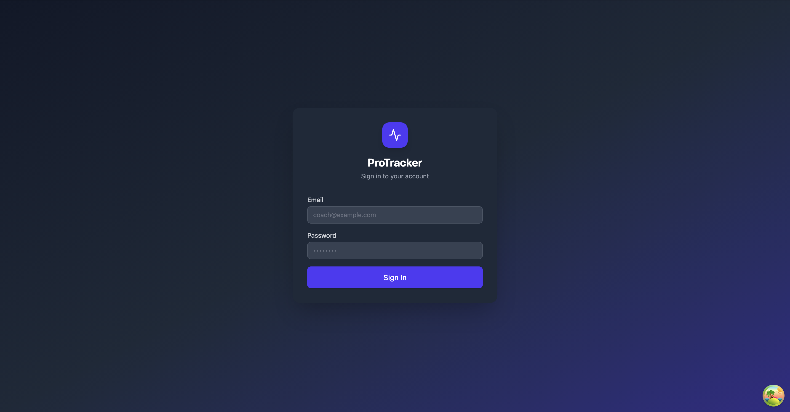
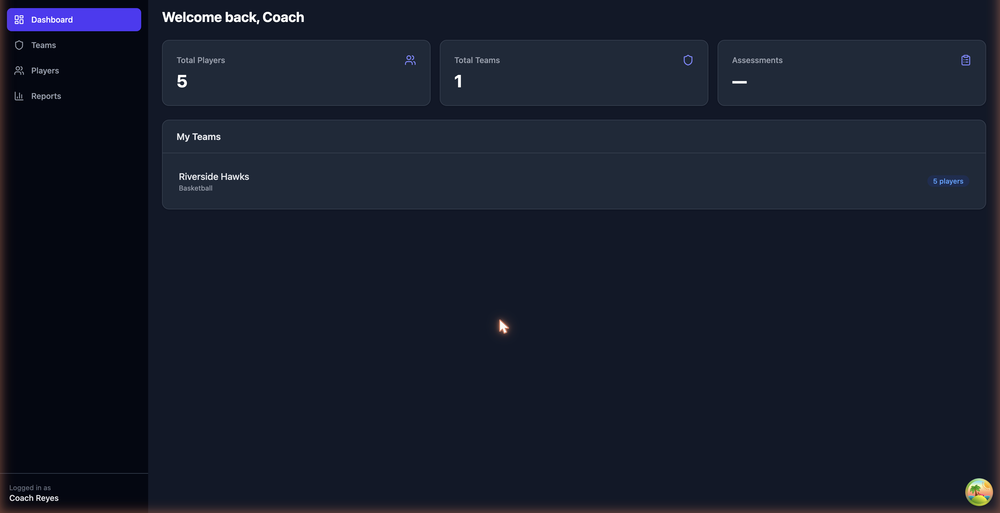
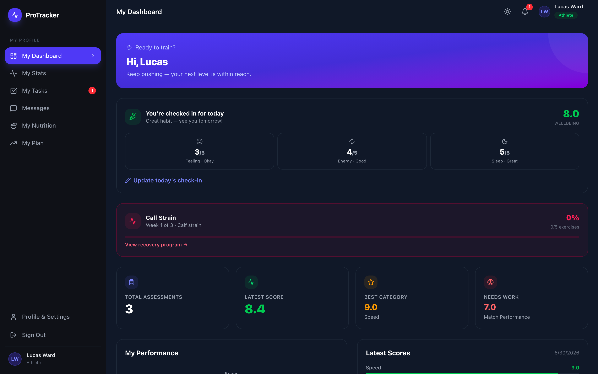
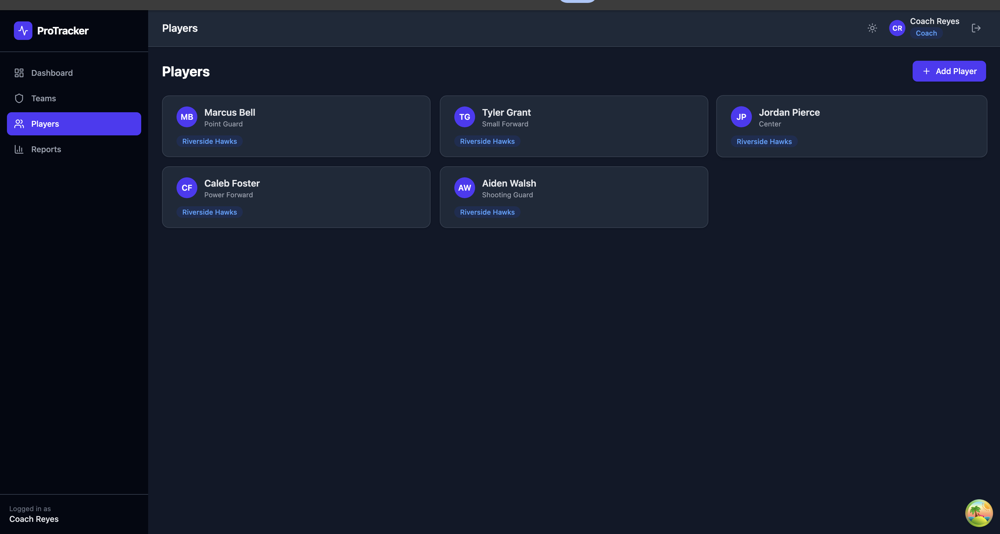
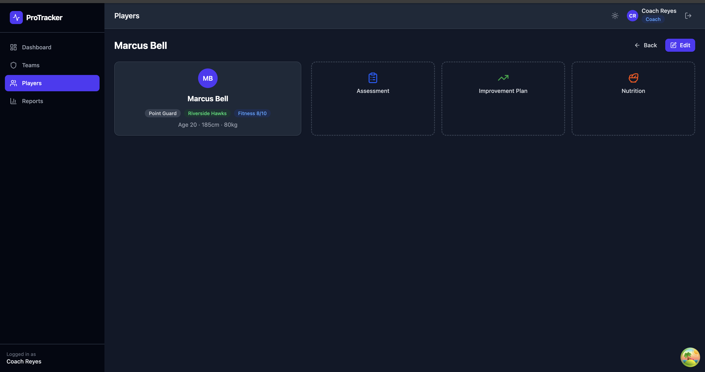

# ProTracker

> Sports performance tracking for coaches and athletes — assessments, improvement plans, and nutrition guidance in one place.


---

## What is ProTracker?

ProTracker is a full-stack sports performance platform built for coaches and athletes. Coaches manage teams, run assessments across configurable stat categories, and generate AI-powered improvement and nutrition plans. Athletes get a personalized dashboard showing their progress over time, radar charts of their latest stats, and structured guidance from their coach.

---

## Features

- **Role-based dashboards** — separate views for Coach and Athlete roles
- **Multi-sport data model** — sports, teams, positions, stat categories all fully configurable
- **Player assessments** — record stat scores per assessment period and track progress over time
- **Improvement plans** — weekly goals, drills, position focus, and coach notes (AI-assisted)
- **Nutrition guidance** — dietary preferences, meal suggestions, hydration and recovery tips (AI-assisted)
- **JWT authentication** — HttpOnly cookie sessions; no tokens in localStorage
- **Dark mode** — full light/dark theme toggle
- **Animated UI** — Framer Motion page transitions and sidebar animations
- **Charts** — Line, Radar, and Bar charts via Recharts
- **34 passing integration tests** — full REST API test coverage

---

## Tech Stack

### Backend

| Layer | Technology |
|---|---|
| Framework | ASP.NET Core 8 Web API |
| Language | C# 12 |
| ORM | Entity Framework Core 8 |
| Database | SQLite |
| Auth | JWT Bearer tokens (HttpOnly cookies) |
| Testing | xUnit + EF Core InMemory (34 tests) |

### Frontend

| Layer | Technology |
|---|---|
| Framework | React 19 + Vite 8 |
| Language | TypeScript (strict) |
| Styling | Tailwind CSS v4 |
| State | TanStack Query v5 |
| Routing | React Router v6 |
| HTTP | Axios (withCredentials) |
| Charts | Recharts |
| Animation | Framer Motion |
| Testing | Vitest + React Testing Library |

---

## Getting Started

### Prerequisites

- [.NET 8 SDK](https://dotnet.microsoft.com/download/dotnet/8.0)
- [Node.js 20+](https://nodejs.org/)

### 1. Clone

```bash
git clone https://github.com/MajdArow123/ProTracker.git
cd ProTracker
```

### 2. Run the backend

```bash
dotnet restore
dotnet run
# API available at http://localhost:8080
```

The database seeds automatically on first run with teams, players, and sample assessments.

### 3. Run the frontend

```bash
cd protracker-client
npm install
npm run dev
# App available at http://localhost:5173
```

### 4. Run backend tests

```bash
dotnet test
# 34/34 passing
```

### 5. Run frontend tests

```bash
cd protracker-client
npm test
# 5/5 passing
```

---

## Seed Accounts

| Role | Email | Password |
|---|---|---|
| Coach | `coach.basketball@protracker.seed` | `SeedCoach123!` |
| Coach | `coach.soccer@protracker.seed` | `SeedCoach123!` |
| Athlete | `marcus.bell@protracker.seed` | `SeedCoach123!` |
| Athlete | `aisha.torres@protracker.seed` | `SeedCoach123!` |
| Athlete | `james.chen@protracker.seed` | `SeedCoach123!` |

---

## API Endpoints

### Auth

| Method | Endpoint | Description |
|---|---|---|
| `POST` | `/api/auth/login` | Login, returns HttpOnly JWT cookie |
| `POST` | `/api/auth/logout` | Clear session cookie |
| `GET` | `/api/auth/me` | Get current authenticated user |
| `POST` | `/api/auth/register` | Register new account |

### Core Resources

| Method | Endpoint | Description |
|---|---|---|
| `GET` | `/api/teams` | List teams (coach's own) |
| `GET` | `/api/teams/{id}` | Team detail |
| `POST` | `/api/teams` | Create team |
| `GET` | `/api/players` | List players |
| `GET` | `/api/players/{id}` | Player detail |
| `POST` | `/api/players` | Create player |
| `GET` | `/api/sports` | List sports |
| `GET` | `/api/sports/{id}/stat-categories` | Stat categories for a sport |

### Assessments & Analytics

| Method | Endpoint | Description |
|---|---|---|
| `GET` | `/api/player-assessments/player/{id}` | Player's assessment history |
| `POST` | `/api/player-assessments` | Record new assessment |
| `GET` | `/api/dashboard/coach` | Coach summary (teams + player counts) |
| `GET` | `/api/dashboard/player/{id}` | Athlete summary (stats + recent assessments) |

### Plans & Nutrition

| Method | Endpoint | Description |
|---|---|---|
| `GET` | `/api/improvement-plans/player/{id}` | Player's improvement plans |
| `POST` | `/api/improvement-plans` | Create improvement plan |
| `GET` | `/api/nutrition-profile/player/{id}` | Player's dietary preferences |
| `GET` | `/api/nutrition-guidance/player/{id}` | Player's nutrition guidance |
| `POST` | `/api/nutrition-guidance` | Create nutrition guidance |

All responses are wrapped: `{ "success": true, "data": <payload> }`

---

## Project Structure

```
ProTracker/
├── Controllers/                  → REST API controllers
│   ├── AuthController.cs
│   ├── DashboardController.cs
│   ├── PlayersController.cs
│   ├── TeamsController.cs
│   ├── PlayerAssessmentsController.cs
│   ├── ImprovementPlansController.cs
│   └── NutritionController.cs
├── Models/                       → EF Core entities
├── DTOs/                         → Request/response shapes
├── Data/                         → DbContext + seeder
├── Services/                     → Business logic
├── Tests/                        → 34 integration tests (xUnit)
│
└── protracker-client/            → React frontend
    └── src/
        ├── api/                  → Axios service files
        ├── components/
        │   ├── ui/               → Button, Card, Badge, Modal, Toast…
        │   ├── layout/           → Sidebar, Navbar, PageWrapper
        │   └── charts/           → Line, Radar, Bar chart wrappers
        ├── context/              → AuthContext, ThemeContext, ToastContext
        ├── hooks/                → TanStack Query hooks
        ├── pages/
        │   ├── auth/             → LoginPage
        │   ├── dashboard/        → Coach + Athlete dashboards
        │   ├── players/          → Players list + detail
        │   ├── teams/            → Teams list + detail
        │   ├── assessments/      → Assessment recording
        │   ├── improvement/      → Improvement plans (coach)
        │   └── nutrition/        → Nutrition guidance (coach)
        └── types/                → TypeScript interfaces
```

---

## Screenshots

### Login


### Coach Dashboard


### Athlete Dashboard


### Players


### Player Profile


---

## License

MIT © [MajdArow123](https://github.com/MajdArow123)
